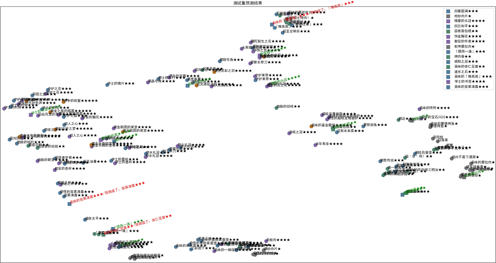

# bgi_grid_classify
一个少样本学习项目  

## 目标  
如图所示，数据集是一些物品的图片，目标是做它们的图片识别：  
  

鸭蛋提议可以采用ImageHash的方法，这是一种搜索引擎们常用的图片相似度算法，比如“以图搜图”功能。  
最近村里机器学习非常火，想了一下还是赶时髦吧，pytorch、启动！  

## 数据集概述
数据集采用BetterGI（https://github.com/babalae/better-genshin-impact） 获取到的图片，在1080p游戏分辨率下采集。  
基础信息是：文件格式为png、RGB三通道、分辨率根据采集任务的不同有多种来源：  
1. 一期数据：背包中各个物品分类界面中采集到的Grid图标，分辨率近似125x153（宽，高），物体在图片上方的125x125区域中；配有固定的几种颜色的背景，带各种游戏标记图案和滤镜；
	* 物体在图片上方的125x125区域中
	* 在下方物品的数量或者等级数字会有变化，但似乎对学习没有多少帮助，可以裁去
	* 配有固定的几种颜色的背景：灰、绿、蓝、紫、橙
	* 在左上角会有各分类下的细节图标。但是本项目未显式地加以利用。
	* 在右上角会有“新”的变化、以及物品当前装备的角色头像变化。但个人猜测这一变化对神经网络的泛化能力没有太大帮助，所以并未加以利用。
	* 在下部会有黄色的星星，星星数代表物品的星级。例如圣遗物分类下的图标，同一种圣遗物会有两档星级
	* 食物分类下的图标，大部分会有“奇怪的”、“美味的”、以及普通无前缀的变化。其中，奇怪的食物基本上是在原图上降低了色彩的饱和度；美味的食物基本上是在原图上增加了一层金黄色的滤镜，并且点缀了闪闪发亮的图案
	* 武器分类下的图标，根据武器强化等级的不同会有变化。但是本项目并未加以利用。
	* 由于采集算法的影响有几个像素的平移

2. 二期数据：圣遗物套装筛选界面中采集到的圣遗物套装图标，实际上是套装对应的生之花的图标。原图比较小，BetterGI程序在采集后再放大到125x125作为数据集保存。
	* 原图由于是被降采样过的，丢失了一些像素细节
	* 由于采集算法的影响有几个像素的平移，且由于是按照经验比例放大，会有缩放失真
	* 背景是打开背包前的游戏画面，经过游戏引擎的模糊、亮度均衡等步骤得来的

  
其中，所有物品的星星数、以及食物的美味程度前缀在BetterGI代码中已做了采集，可以通过分离文件名简单地获取。不同来源的样本可以归类到子文件夹中，子文件夹名称也提供了数据，来源于背包食物界面的应以“Food”开头。  

如上所述，可以看出这是个K-way, N-shot的问题，其中K是一个成百上千的数，因为游戏中网格界面的物品图标基本上都是这个样式；而N的取值为1-3，对于圣遗物一般是2、对于食物一般是3、对于其他物品则为1。

## 训练方法
采用了一个简单的三层卷积神经网络作为基础。利用卷积神经网络的特性，微小的平移能保证适应。  

输入是数据图像的像素（CxHxW）  
 

### 调整神经网络结构
确定训练任务如下：  
1. 主任务：对物品种类的分类  
输出采用原型网络的思想，将卷积网络最后的全连接层直接输出作为特征向量代表物品分类在高维空间中的位置，通过计算预测数据的特征向量到原型的欧氏距离来判断预测数据的物品分类。  
损失函数采用此类网络常用的三元损失（TripletMarginLoss）。在三元组的构造时，针对单样本数据，直接使用该样本同时作为锚点和正样本；同时约束锚点到负样本（Anchor-Negative）的距离和锚点到正样本（Anchor-Positive）的距离，以期类间足够远、类内足够近；负样本选取批次内距离最近，即最难的样本。  
由于单纯的少样本学习，尤其本任务几乎也是个单样本学习任务，几乎是奔着过拟合去的，导致可能不会有实际的意义，因此引入多任务学习，希望通过子任务的监督信息，网络能隐式地学会更多基于特征的分类。
2. 子任务一：对星星数的分类  
通过在三层卷积网络的最浅层外接一个全连接层，并像普通的分类任务一样，进行归一化来输出每种星星数的概率，一共有6种星星数（无到五个星星）。  
  由于还要考虑背包Grid界面以外的样本，将星星数和星级两个概念脱钩，单纯只数星星的话，在子任务的开始时对输入进行截取，只要底部区域像素对应的张量即可。  
	
	> 物品星级影响的是背景的颜色和下方的星星数量，每种星级的背景色是固定的，不会影响物品的图案，这些可以认为是卷积网络的浅层特征
3. 子任务二：对物品美味程度的分类  
通过在主任务的全连接层输出后追加一个全连接层，并像普通的分类任务一样，进行归一化来输出美味程度，一共有3种美味程度  
	> 这个子任务尚不完善，因为只有食物才有美味程度，笼统地把其他分类的图案都作为普通来处理的话，由于许多非食物物品实际上具有与“奇怪的”或“美味的”相似的特征，这个子任务就不容易收敛，甚至可能有反效果。最好是在输入时同时传入物品的大类分类来优化。  
	> 尽管不完善，但猜测其有助于主任务的学习，固保留。
4. 子任务三：判断是否是来源于背包食物界面  
通过在三层卷积网络的最浅层外接一个全连接层并直接用激活函数运算，得到来源于背包食物界面的概率。这样就可以为子任务二提供条件判断，改进其效果。

将四个任务的损失函数进行加权求和作为整个任务的损失，其中子任务二的损失在样本不是来源于背包食物界面时为零。  
然后基本上就是在过拟合和泛化性能之间做各种参数的调整。

### 划分数据集
因样本稀少，直接放弃使用验证集，只有训练集和最终的测试集。
所有只有一个样本的物品，既做训练，又做测试；而如果该物品种类有两个样本或三个样本，则可以从中挑选一定数量，取出一个样本做测试，其余样本做训练，未挑选的种类则将所有样本同时做训练和测试。

## 实际效果
使用UMAP对原型特征向量进行降维，观察效果：
  
可以看到：
* 训练集自身位置在降维后的向量空间中用横平的黑色字体表示，测试集则用倾斜的彩色字体表示，单样本/双样本/三样本输入测试集的数量为10/5/1，结果：物品分类和星级分类的准确率都是16/16，而美味程度分类的准确率未满，但是考虑到该子任务的缺陷这是可以接受的。  
  经过新增子任务三的改进，现在美味程度分类效果已有所提高。
* 食物、圣遗物和养成道具的三个类别基本有了各自的分布
* 没有相同的分类标签但图案相近、游戏中关联密切的样本有了一点聚簇，如“杏仁豆腐、「美梦」[图片参考](https://wiki.biligame.com/ys/%E6%9D%8F%E4%BB%81%E8%B1%86%E8%85%90)”、“满足沙拉、至高的智慧（生活）[图片参考](https://wiki.biligame.com/ys/%E6%BB%A1%E8%B6%B3%E6%B2%99%E6%8B%89)”


## 一些额外处理
因为预期要放到BetterGI上使用，有必要将模型输出设置为onnx格式，并且须要限制网络参数量。

### 脚本使用方法
1. 编辑`train.py`，将`root_dir`更改为数据集所在路径，根据样本总量调整`split_into_train_test` 方法的入参，其分别是单、双、三样本放入测试集的数量。 
	
	```
    root_dir = r'爆炒肉片new'
    train_set, test_set = split_into_train_test(root_dir, 10, 5, 1)
	```
	训练过程参数的调整不在此赘述。  
2. 运行`train.py`，结束后目录下产生的`model.onnx`即为模型，`训练集原型特征.csv`是保存了原型向量的文件。  
3. 运行`visualizeModel.py`可查看训练样本的UMAP降维可视化图。
4. 运行`test.py`对测试集进行预测，运行`visualizePred.py`可查看训练样本和预测结果的UMAP降维可视化图。  


#### 以下是杂七杂八的备忘：
##### 仅导出当前项目使用的包
1. `pip install pipreqs`  
2. `cd /path/to/your_project`  
3. `pipreqs . --force`